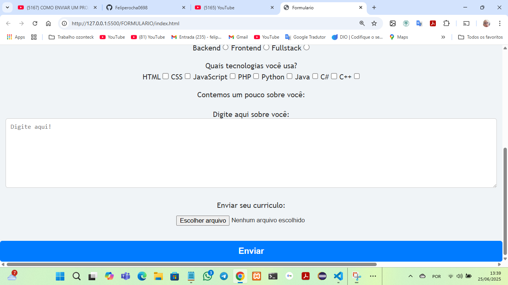
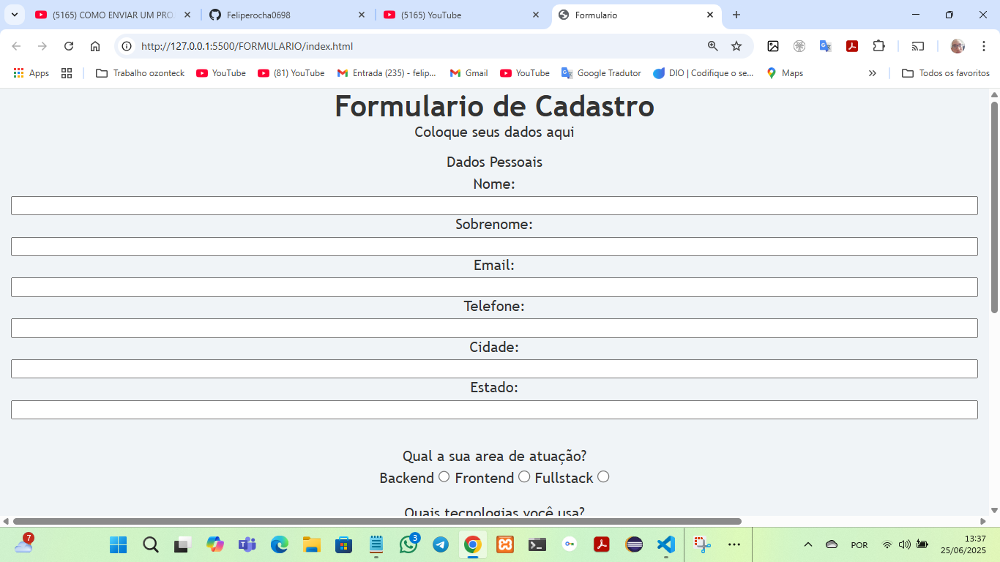
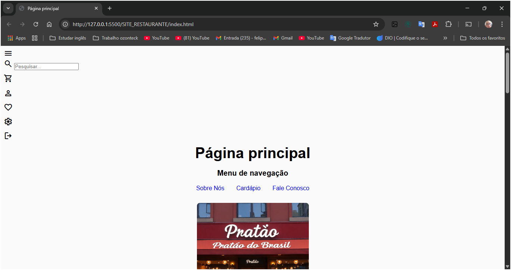
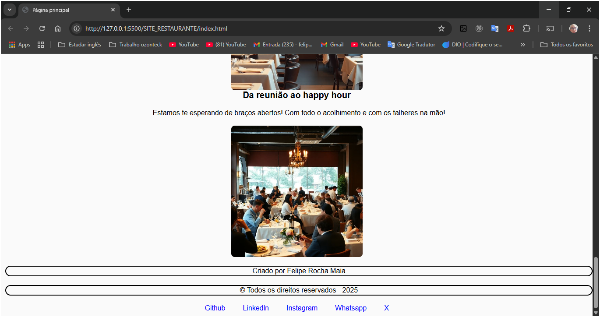
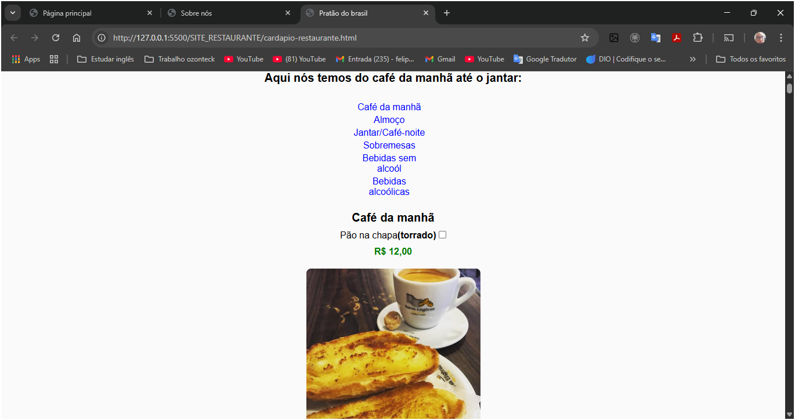
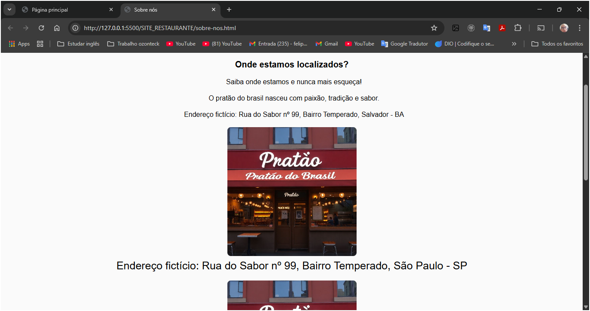
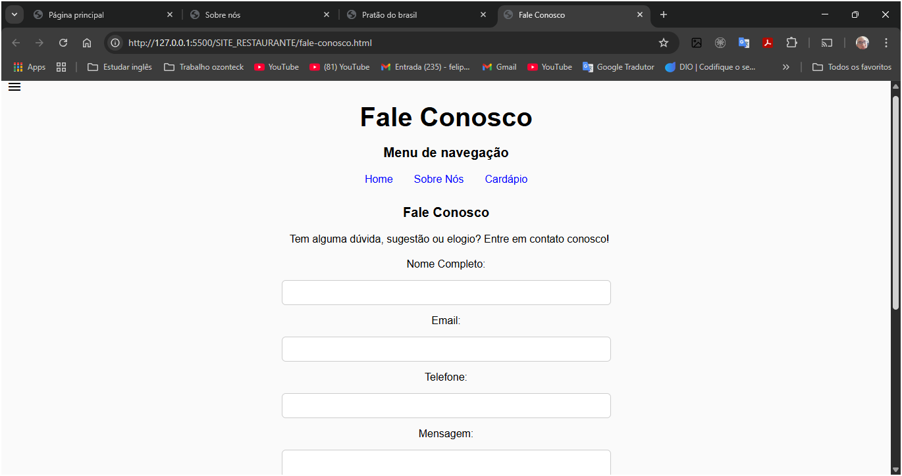

Formulário de Cadastro de Desenvolvedores
Funcionalidades
Cadastro de informações pessoais

Seleção de tecnologias dominadas

Upload de currículo

Visualização dos dados cadastrados diretamente na tela (sem backend)

📚 O que eu aprendi com este projeto
Durante a construção deste formulário, pratiquei e aprofundei os seguintes conhecimentos:

Uso correto das tags semânticas do HTML5 (form, fieldset, legend, label, etc.)
Criação de formulários acessíveis e bem estruturados
Aplicação de estilos com CSS para melhorar a apresentação do formulário
Manipulação do DOM com JavaScript
Prevenção do envio automático do formulário com preventDefault()
Captura e exibição dinâmica dos dados digitados pelo usuário
Tecnologias usadas
HTML5, CSS3 E JAVASCRIPT

📸 Imagens do projeto
PARTE DE BAIXP DO FORMULÁRIO Imagem do formulário



PARTE DE CIMA DO FORMULÁRIO, C/ O CAMPO PRA COMENTÁRIOS E BOTÃO DE ENVIO Imagem do formulário



# 🍽️ Site de Restaurante

Este projeto é uma página institucional de um restaurante fictício, desenvolvida com foco em estruturação semântica, design responsivo e organização visual. Ideal para portfólio ou como base para sites reais de pequenos negócios.

---

## 📸 Prints do Projeto

### Página Principal



### Página Cardápio


### Sobre Nós


### Fale Conosco


---

## 🛠️ Tecnologias Utilizadas

- **HTML5** — estrutura semântica
- **CSS3** — estilização e responsividade
- **JavaScript** — interações básicas (se aplicável)

---

## 📚 Funcionalidades

- Página inicial com destaque visual
- Cardápio com imagens e descrição dos pratos
- Seção institucional “Sobre Nós”
- Formulário de contato funcional (sem backend)
- Layout adaptado para dispositivos móveis

---

## 🚀 Como visualizar

Você pode abrir o projeto localmente:
```bash
1. Clone o repositório
2. Abra o arquivo index.html na pasta SITE_RESTAURANTE

Projetos-freelancer/FORMULARIO/readme.md at
